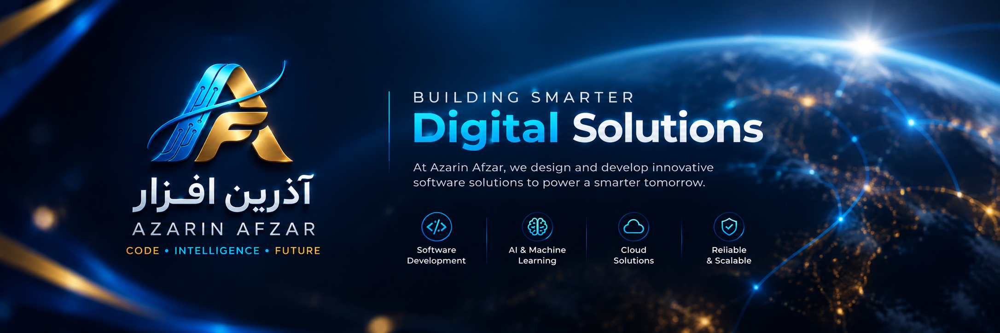

# AZARIN AFZAR

### Code • Intelligence • Future



<div align="center">


<br/>

[](https://git.io/typing-svg)

<br/>


</div>

---

## ✦ درباره ما

**آذرین افزار (Azarin Afzar)** یک شرکت فناوری‌محور است که ایده‌ها را به راهکارهای دیجیتال کاربردی، مقیاس‌پذیر و معنادار تبدیل می‌کند.

ما **مهندسی نرم‌افزار، فناوری‌های هوشمند، تفکر خلاقانه و اجرای مشارکتی** را در کنار هم قرار می‌دهیم تا ایده‌ها را از فرصت به تأثیر برسانیم.

<div align="center">

> ### 💡 *Build intelligently. Create boldly. Deliver impact.*

</div>

---

## ⚡ حوزه‌های فعالیت

<div align="center">

| حوزه | توضیح |
|:---:|---|
| 💻 **نرم‌افزار و محصول** | محصولات دیجیتال مدرن، قابل‌نگهداری و مقیاس‌پذیر |
| 🧠 **هوش مصنوعی و سیستم‌های هوشمند** | راهکارهای عملی AI متمرکز بر نتایج واقعی |
| 🔄 **تحول دیجیتال** | نوسازی فرآیندها، سیستم‌ها و تجربه‌های دیجیتال |
| ⚙️ **اتوماسیون و بهینه‌سازی** | ساده‌سازی گردش‌کار و افزایش بهره‌وری |
| 🧭 **مشاوره فناوری** | تبدیل چالش‌های پیچیده به استراتژی‌های فنی روشن |

</div>

---

## 🚀 رویکرد ما

<table align="center">
<tr>
<td align="center" width="25%">

### 📈 رشد
یادگیری مستمر، بهبود و ارزش‌آفرینی

</td>
<td align="center" width="25%">

### 💡 نوآوری
تبدیل ایده‌های امیدبخش به فناوری کاربردی

</td>
<td align="center" width="25%">

### 🤝 همکاری
ترکیب تخصص‌ها و دیدگاه‌های متفاوت

</td>
<td align="center" width="25%">

### 🎯 تأثیر
راهکارهایی مفید، پایدار و معنادار

</td>
</tr>
</table>

---

## 🧩 فلسفه فناوری

ما باور داریم فناوری باید فراتر از چشم‌نواز بودن باشد — **باید مفید باشد.**

<div align="center">

```
✓ مهندسی تمیز و قابل‌نگهداری       ✓ معماری مقیاس‌پذیر
✓ امنیت و پایداری                  ✓ تفکر محصول‌محور کاربر
✓ تصمیم‌گیری داده‌محور              ✓ استفاده مسئولانه از AI
✓ بهبود مستمر
```

</div>

---

## ◈ چشم‌انداز

<div align="center">

> **کد به هوش تبدیل می‌شود.**  
> **هوش به نوآوری تبدیل می‌شود.**  
> **نوآوری آینده را شکل می‌دهد.**

</div>

ما در حال ساخت اکوسیستمی فناورانه هستیم که در آن مهندسی و هوش مصنوعی در کنار هم، پیشرفتی معنادار می‌آفرینند.

---

## 🎯 مأموریت

<div align="center">

### `People` + `Ideas` + `Engineering` + `Intelligence`

</div>

مأموریت ما تبدیل چالش‌های پیچیده به راهکارهایی **ظریف، قابل‌اعتماد و تأثیرگذار** است — همراه با ساخت قابلیت‌ها، محصولات و شراکت‌های بلندمدت.

---

## 🌐 طرز فکر آذرین افزار

ما فقط نرم‌افزار نمی‌سازیم.

ما در حال ساخت **ایده‌هایی هستیم که می‌توانند رشد کنند، فناوری‌ای که می‌تواند مقیاس بگیرد، و راهکارهایی که می‌توانند تفاوت ایجاد کنند.**

<div align="center">

**کنجکاوی → مهندسی → هوش → نوآوری → تأثیر**


</div>

---

## 📫 ارتباط با ما

<div align="center">

[](#)
[](#)
[](#)
[](#)

<br/>


</div>

### AZARIN AFZAR

**Code. Intelligence. Future.**

</div>
